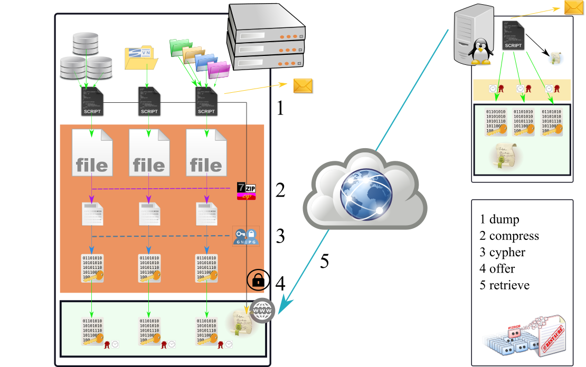

# BackupScriptsForSharedHosts  # ;-**- mode: org -**-

*(French version below)*

## Genesis and aim of the project

Collection of tools to perform backups  (MySQL, SVN, FS) and exfiltrate them.
This project has been initiated to backup the forum and the wiki of an hiking
association. Some  features has been  added to  make tools less  specific. In
fact,  now it's  more a  kind of  library useful  to write  tools than  tools
themselves.

It is currently in  production (July 2016). Feel free to  fork the project or
contribute to it. 

On July, 2016 the project migrated to GitHub (losing subversion history).

Christmas 2017, some plugin have been added in an annex project.

### General : how it works :

When you need to  backup a server `HOST A` (where you're  not root), you can
use the scripts  which start which `backup_` via a  crontab. Then they build
archives and put them in a pseudo public area.

In a second time, another machine `HOST B` can connect to this pseudo public
aera in HTTP(s)  and retrieve those archives :  see `import_backup2.sh`. You
can have a relative trustness in the local admin as the archives are cyphered

### What can be saved ?

1.  Crontab

    The crontab used to schedule backups :-)

2.  MySQL

    MySQL databases via a full dump of each schema or  some specific ones.

3.  Subversion

    Scan  a directory  containing repositories  and perform  a dump  foreach of
    them. 

4.  Filesystem

    The   forum  (`www`)   and   the  wiki   (`wiki`)   use  specific   scripts
    (`backup_wiki.sh` and `backup_web.sh`) but it's quite easy to adapt to your
    needs.

### Installation

Two steps are required :

1.  Get the code
2.  Configure

They are 2 methods:

1.  Get the code : the git way

    If git is available on the host :
    
        $ git clone https://github.com/FAbOnGitHub/BackupScriptsForSharedHosts cgi-bin

2.  Get the code : the harder way

    If git is not  available on the host you'll have to get  the code locally 
    
        $ git clone https://github.com/FAbOnGitHub/BackupScriptsForSharedHosts cgi-bin
    
    and then put it on the host (via ssh, scp, ftp, any way you could use)

### Getting the last version : how to update

Like «Get the  code», you can overwrite the code  directory (except for your
own scripts). 
Read  the  documentation  for  the  new variables  and/or  use  the  command
« `diff_config.sh` » 

### Configuration

Currently  a  lot  of  things  are  explained  (*in  french*)  in  the  file
`config.txt`).

But, fortunately, configuration file `config_default.sh` is widely commented.

Scripts on `HOST A` can use three level of configuration file :

1.  First `config_default.sh` in `cgi-bin` (default parameters)
2.  `config_priv.sh` in `cgi-etc`  (your param)
3.  `config_<hostname>.sh` in `cgi-etc`  (optional)

`HOST B` which hosts `import_backup2.sh` use this file **in addition** :
`config_<hostname>_dist.sh` in `cgi-etc`

**Nota** :  <hostname> is the  result of bash  command "hostname -s".  In some
clusters this  command could  return something not  trivial. Test  it before
usage.

### Extra features :

-   Server Host A can  ask to retrieve additional files unknown  by host B via
    the file "`Please_backup.lst`"
-   nearly every thing  is logged and the  logs of `Host A` are  retrieve to 
    `Host B` anyway
-   notification by email provided
-   Client checkes the date of the dumped archive via a metadata file
-   Like date, CRC is checked
-   script to check configuration is provided
-   Long Term Support directory for imported archives : archives are retrieved
    and stored  by day except  that you can  specify a day  to push them  in a
    non-overwritten directory.

### Daily usage : how to be warned ?

If you can enable the mail system, you  will receive a mail by script and by
day. 

You can apply  a mail-filter on the subject with  begins with "`script[ok]`"
or "`script[KO]`".  You can autmaticly redirect  the ok' ones into  a folder
and keep the KO into the inbox.

### What about security ?

-   Every step is logged into a log file.

-   Archives  are accessible  
    -   via an  hidden  URL (pseudo  public)
    -   and  realm password (optional)
    -   with a filter on the user-agent (optional)

But you should use SSL too if you can.

-   All archives are cyphered but default : All dumps are written to a private
    directory. Then  there are compressed  with zip  and a password  (which is
    weak) or if it's possible via gnupg (much stronger)

Indeed, it comes with no guaranties :-)

### How to write my own script ?

First, look at the small ones like `backup_crontab.sh`. It's quite simple :

1.  load the library "`boot.sh`"
2.  do your dump in a file
3.  call `do_moveXferZone` on that file. That's it!

**Nota** : if you  write a script, be careful of dumping  in a portable format
(ie it's  not really  safe to  copy MySQL databases  files with  `cp`&#x2026; use
`mysqldump` instead of.)

### Known problems

1.  Server : Disk space and bandwith issues

    When you  dump your data, they  are written on  the disk and then  they are
    compressed and/or  cyphered which consume space  on the hard drive.  You be
    conscious of that. When  saving an object of 1GB, the  script may write 1GB
    on the HDD&#x2026;
    **Free space** available is not tested (yet).
    
    Currently (November 2016),  they are no incremental backup  provided but it
    is in the road map (for directory dumps).
    
    Please realize  that the  aim of  the project  is to  protect your  data by
    letting you  having a copy somewhere  else&#x2026; It must just  work&#x2026; but not
    work efficiently. Some it saves data, no a optimized subset of data.

2.  Client : disk space issue

    When the system functions great, it's quite easy to forget it!!!
    So be  careful with the  Long Term Support  directory which may  grow until
    fulling the hard drive disk.

3.  Server : timeout

    On some  web server,  script have a  very short time  to execute,  so using
    `exec2.php` or `trigger_backup.sh` may fail. 

4.  Missing mail command :

    This case is not handled gracefully&#x2026; A script, able to send mail, will be
    provide soon. You should watch the logs file.

## French version : en Français

Ce projet regroupe un ensemble  d'outils pour permettre faire des sauvegardes
d'un serveur  où l'on  n'est pas  administrateur (root)  et de  les récupérer
depuis une autre  machine pour avoir une copie physique  ailleurs. L'idée est
aussi de pouvoir  utiliser ces outils de manière à  permettre des échanges de
bons procédés (réciprocité) en stockant  des archives chiffrées chez un tiers
de confiance relative.

À la base il s'agissait de sauvegarder  de manière fiable le forum et le wiki
d'une association hébergés sur une machine mutualisée chez l'hébergeur OVH.

Des fonctionnalités ont  été ajoutées pour permettre  de sauvegarder d'autres
objets pour d'autres cas. 

**Au final** l'intérêt réside peut-être  plus dans ls bibliothèque de fonctions
pour écrire de tels scripts que dans les scripts fournis.

